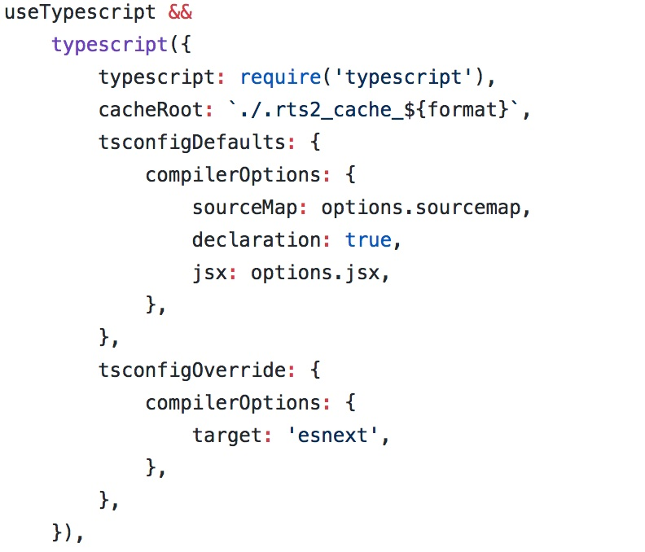
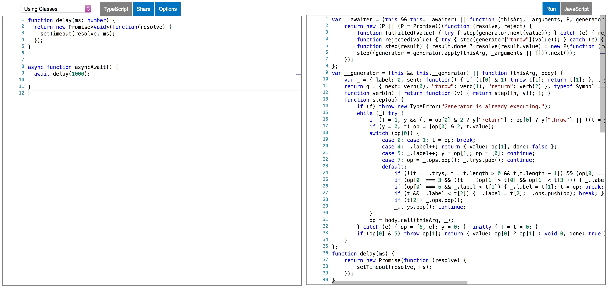
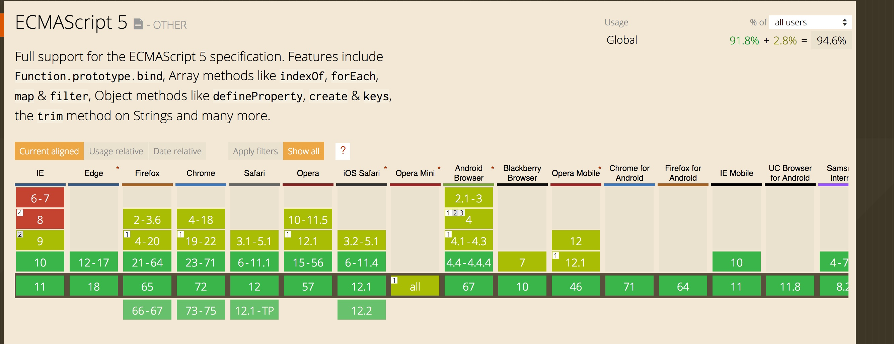
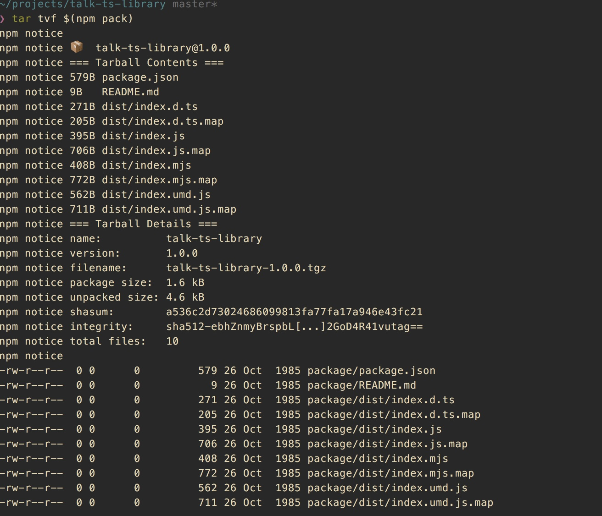
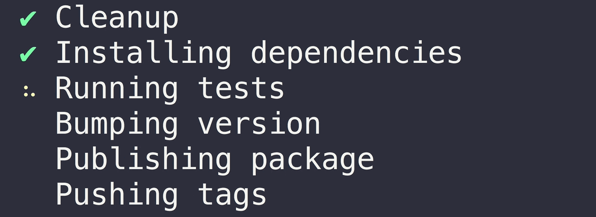
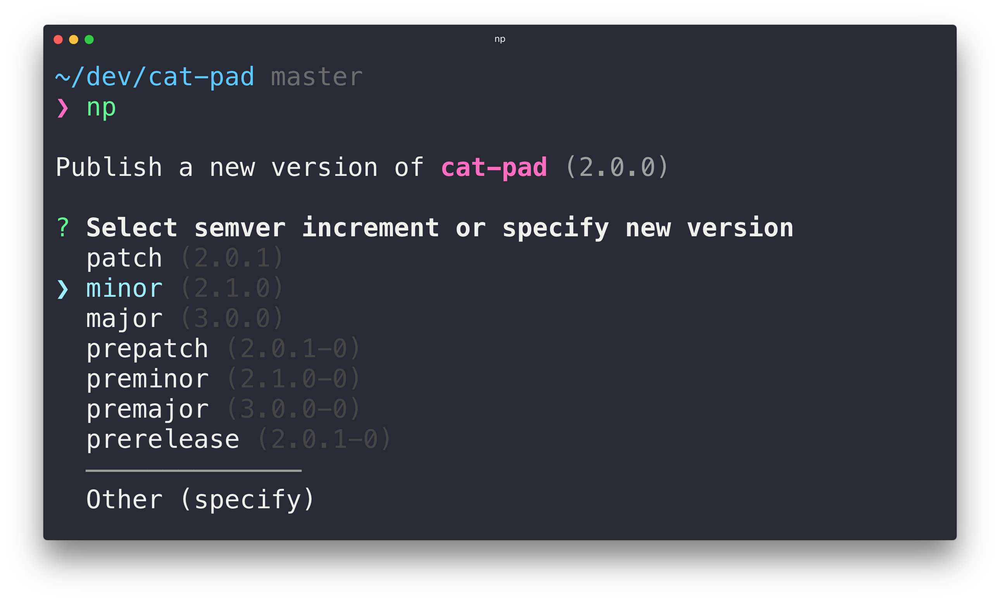
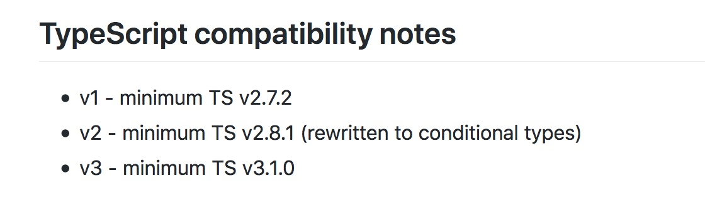
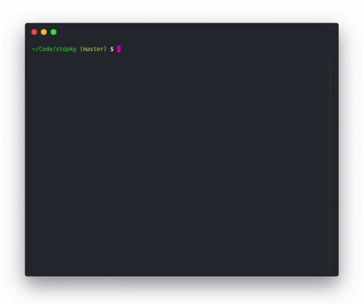

import { condensed } from 'mdx-deck/themes'
import twilight from 'react-syntax-highlighter/styles/prism/twilight'
import { CodeSurfer } from "mdx-deck-code-surfer"


export const theme = {
  ...condensed,
  css: {
    ...(condensed.css),
    "li ul, li ol": {
      fontSize: 'inherit !important',
    },
    'li > p': {
      fontSize: 'inherit !important',
      margin: 0
    },
  },
   prism: {
    style: twilight
  }
}

# TypeScript library cookbook

<small>
  Jakub Chodorowicz<br/> 
  github.com/chodorowicz <br/>
  twitter @chodorowicz
</small>

---

## Where did I use it

- https://github.com/chodorowicz/ts-debounce

```js
import { debounce } from 'ts-debounce';

const debouncedFunction = debounce(originalFunction, waitMilliseconds, options);
```

---

<div style={{ fontSize: '30px'}}>
<CodeSurfer
  title="First things first"
  code={require("!!raw-loader!./slides/example.js")}
  showNumbers={true}
  steps={[
    { lines: [2], notes: "name" },
    { lines: [3], notes: "version" },
    { lines: [4], notes: "description" },
    { lines: [5], notes: "keywords" },
    { lines: [6], notes: "homepage" },
    { lines: [7,8,9], notes: "bugs" },
    { lines: [10], notes: "files" },
    { lines: [11], notes: "licence" },
    { lines: [12], notes: "main module" },
    { lines: [13], notes: "ES2015 modules build" },
    { lines: [14], notes: "browser build" },
    { lines: [15], notes: "optional types path" },
    { lines: [16], notes: "author" }
  ]}
/>
</div>

```notes
- MIT:
  - open and permissible,
  - no-brainer / simple,
  - allows both free and commercial re-use,
  - short,
  - clearly gives you copyright,
  - well-known and widely used.
- files
  - files which will be added to the tarball when it’s packed. 
  - Omitting the field will make it default to ["*"], which means it will include all files.
  - can use `.npmignore` field, `.gitignore` is also respected
  - remove probably test folder from the tarball
  - Certain files are always included, regardless of settings:
    - package.json, README, CHANGES / CHANGELOG / HISTORY, LICENSE / LICENCE, NOTICE, The file in the “main” field
    - excluded: .git, .DS_Store, node_modules,...
- main module
  - module https://webpack.js.org/guides/author-libraries/#final-steps
  - https://github.com/rollup/rollup/wiki/pkg.module
  - Michael Jackson files: https://medium.com/the-node-js-collection/an-update-on-es6-modules-in-node-js-42c958b890c
- types
  > Also note that if your main declaration file is named index.d.ts and lives at the root of the package (next to index.js) you do not need to mark the "types" property, though it is advisable to do so
- files
  - If the "files" and "include" are both left unspecified, the compiler defaults to including all TypeScript (.ts, .d.ts and .tsx)
```

---

## What do you need

microbundle (with TypeScript) + NP

```sh
npm i --D microbundle np

mkdir src && cd src && touch index.ts
```

```notes
Jason Miller
Sindre Sorhus
```

---

## Configure TypeScript

- not much here to do `¯\_(ツ)_/¯`
- microbundle/rollup-plugin-typescript2 enforces most of options

```json
{
  "compilerOptions": {
    "strict": true,
    "noUnusedLocals": true,
    "noUnusedParameters": true,
    "esModuleInterop": true, // if needed
    "declarationMap": true
    // other important declaration can be left out when using microbundle
  }
}
```

```notes
Emit __importStar and __importDefault helpers for runtime babel ecosystem compatibility and enable --allowSyntheticDefaultImports for typesystem compatibility.

```

---

## microbundle

- one dependency to bundle your library using only a package.json
- supports multiple entry points
- multiple outputs for each entry - CJS, UMD & ESM
- tiny, optimized
    - terser compression
    - gzipped
    - cssnano

```notes
- UMD (Unified Module Definition) means that you can use one bundle in browser (as <script>) and with require. But it’s not perfect as you think — it adds more code to your bundle.

https://medium.com/@kelin2025/so-you-wanna-use-es6-modules-714f48b3a953
```

---

## Rollup and microbundle enforced config

```
noEmitHelpers: false
importHelpers: true // required tslib, provided by rollup-plugin-typescript2
noResolve: false
noEmit: false
inlineSourceMap: false
outDir: taken from package.json `main`
target: 'esnext' // because it's transpiled by babel and Bublé
declaration: true // generate d.ts files
sourceMap: true
```

```notes
microbundle config: https://github.com/developit/microbundle/blob/master/src/index.js#L454
https://github.com/ezolenko/rollup-plugin-typescript2
- outDir - taken from main in package.json
https://github.com/developit/microbundle/blob/master/src/index.js#L454

generally this setting should be good if using just TS
"importHelpers": true, // importing helper functions from tslib
"noEmitHelpers": true, // disable emitting inline helper functions

- noResolve
  - not add triple-slash references or module import targets to the list of compiled files.
```

---

https://github.com/developit/microbundle/blob/master/src/index.js#L454



---

## Target 🎯 - what is downleveling

- ES3/ES5 downleveling



---

##  What should be the target

- ES5 should be good from most cases 
- https://kangax.github.io/compat-table/es5/
- https://caniuse.com/#search=es5



---

## Controll what you're publishing

- using `.gitignore` and `.npmignore` (blacklisting) considered dangerous
- better use `files` in package.json
- use `npm-packlist` to verify your files

---

## npm-packlist

- `tar tvf $(npm pack)`



---

## Everybody makes mistakes 😔

- https://unpkg.com/ts-debounce@1.0.0/

```notes
present https://unpkg.com/ts-debounce@1.0.0/
```

---

## Publishing steps

- prerequisite: npm account
- Ensure you are publishing from the master branch
- Ensure the working directory is clean and that there are no unpulled changes
- Reinstall dependencies to ensure your project works with the latest dependency tree
- Run the tests
- Bump the version in package.json and npm-shrinkwrap.json (if present) and creates a git tag
- Publish the new version to npm
- Push commits and tags to GitHub/GitLab
- release notes on GitGub

---


## np

- better `npm publish`



---

## interactive np



---

## Add it to dependencies and scripts

```json
{
  "scripts": {
    "build": "microbundle",
    "dev": "microbundle watch",
    "release": "np"
  }
}
```

---

## Backward types compability

- use `typesVersions` (available since TS 3.1)

```ts
{
  "name": "package-name",
  "version": "1.0",
  "types": "./index.d.ts",
  "typesVersions": {
    ">=3.2": { "*": ["ts3.2/*"] },
    ">=3.1": { "*": ["ts3.1/*"] }
  }
}
```

---

## Backward types compability



---

## Backward types compability - other ideas

🤔💭 peerDependencies...

---

## Testing in Typescript of course

- `npm install --save-dev jest ts-jest @types/jest`

---

<div style={{ fontSize: '30px'}}>
<CodeSurfer
  title="First things first"
  code={`
{
  "scripts": {
    "test: "jest"
  },
  "jest": {
    "transform": {
      "^.+\\.tsx?$": "<rootDir>/node_modules/ts-jest/preprocessor.js"
    },
    "testRegex": "(src/__tests__/.*|(\\.|/)(test|spec))\\.ts$",
    "moduleFileExtensions": [
      "js",
      "ts",
      "tsx"
    ]
  }
}
  `}
  showNumbers={true}
/>
</div>


---

## Bonus extra round - Pika Pack

- extensible microbundle + np on one package 🏋️‍

---

## Config

```
// Before: Your top-level package.json manifest:
{
  "name": "simple-package",
  "version": "1.0.0",
  "@pika/pack": {
    "pipeline": [
      ["@pika/plugin-standard-pkg", {"exclude": ["__tests__/*"]}],
      ["@pika/plugin-build-node"],
      ["@pika/plugin-build-web"]
    ]
  }
}
```

---

### Pika demo

```notes
npx pack build
npx pack publish 
```

---

## Publish = np



---

## What else

- CI (e.g. Travis CI)
- test coverage (e.g. Codecov)
- keeping dependencies up to date (e.g. Greenkeeper)

---

## The end

