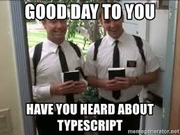

import { condensed } from 'mdx-deck/themes'
import twilight from 'react-syntax-highlighter/styles/prism/twilight'
import { CodeSurfer } from "mdx-deck-code-surfer"


export const theme = {
  ...condensed,
  css: {
    ...(condensed.css),
    "li ul, li ol": {
      fontSize: 'inherit !important',
    },
    'li > p': {
      fontSize: 'inherit !important',
      margin: 0
    },
  },
   prism: {
    style: twilight
  }
}

# TypeScript library cookbook

<small>Jakub Chodorowicz<br/> github.com/chodorowicz</small>

---

## Where did I use it

- https://github.com/chodorowicz/ts-debounce

```js
import { debounce } from 'ts-debounce';

const debouncedFunction = debounce(originalFunction, waitMilliseconds, options);
```

---
<div style={{ fontSize: '30px'}}>
<CodeSurfer
  title="First things first"
  code={require("!!raw-loader!./slides/example.js")}
  showNumbers={true}
  steps={[
    { lines: [2], notes: "name" },
    { lines: [3], notes: "version" },
    { lines: [4], notes: "description" },
    { lines: [5], notes: "keywords" },
    { lines: [6], notes: "homepage" },
    { lines: [7,8,9], notes: "bugs" },
    { lines: [10], notes: "files" },
    { lines: [11], notes: "licence" },
    { lines: [12], notes: "main module" },
  ]}
/>
</div>

```notes
- MIT:
  - open and permissible,
  - no-brainer / simple,
  - allows both free and commercial re-use,
  - short,
  - clearly gives you copyright,
  - well-known and widely used.
- files
  - files which will be added to the tarball when it’s packed. 
  - Omitting the field will make it default to ["*"], which means it will include all files.
  - can use `.npmignore` field, `.gitignore` is also respected
  - remove probably test folder from the tarball
  - Certain files are always included, regardless of settings:
    - package.json, README, CHANGES / CHANGELOG / HISTORY, LICENSE / LICENCE, NOTICE, The file in the “main” field
    - excluded: .git, .DS_Store, node_modules,...
- main module
```
---

## What do you need

microbundle (with TypeScript) + NP

```sh
npm i --D microbundle np

mkdir src && cd src && touch index.ts
```

---

## Configure TypeScript

- not much here to do `¯\_(ツ)_/¯`
- microbundle/rollup enforces most of options

```json
{
  "compilerOptions": {
    "strict": true,
    "noUnusedLocals": true,
    "noUnusedParameters": true,
    "esModuleInterop": true
  }
}
```

---

## Rollup and microbundle enforced config

```
noEmitHelpers: false
importHelpers: true
noResolve: false
noEmit: false
inlineSourceMap: false
outDir: taken from package.json `main`
target: 'esnext' // because it's tranpiled by babel
```

```notes
microbundle config: https://github.com/developit/microbundle/blob/master/src/index.js#L404
https://github.com/ezolenko/rollup-plugin-typescript2
- outDir - taken from main in package.json

```

---

## microbundle

- one dependency to bundle your library using only a package.json
- supports multiple entry points
- multiple outputs for each entry - CJS, UMD & ESM
- tiny, optimized
    - terser compression
    - gzipped
    - cssnano

```notes
- UMD (Unified Module Definition) means that you can use one bundle in browser (as <script>) and with require. But it’s not perfect as you think — it adds more code to your bundle.

https://medium.com/@kelin2025/so-you-wanna-use-es6-modules-714f48b3a953
```

---

## np

- better `npm publish`


---

## interactive np


---

## What does it do?

- Ensures you are publishing from the master branch
- Ensures the working directory is clean and that there are no unpulled changes
- Reinstalls dependencies to ensure your project works with the latest dependency tree
- Runs the tests
- Bumps the version in package.json and npm-shrinkwrap.json (if present) and creates a git tag
- Publishes the new version to npm
- Pushes commits and tags to GitHub/GitLab
- Opens a prefilled GitHub Releases draft after publish

---

## Add it to dependencies and scripts

```json
{
  "scripts": {
    "build": "microbundle",
    "dev": "microbundle watch",
    "release": "np"
  }
}
```

---

## The end

